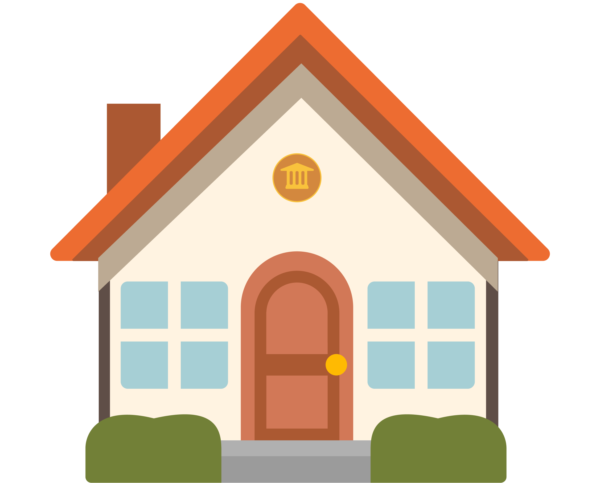
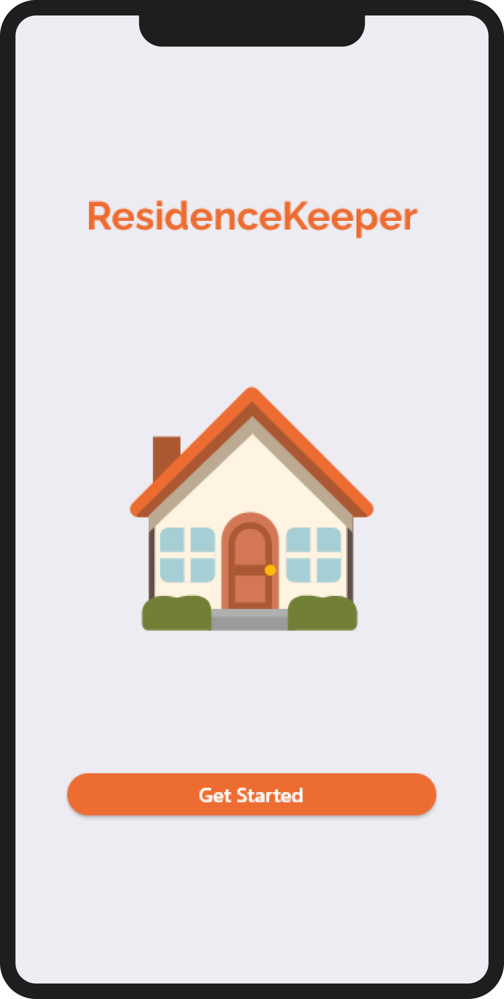
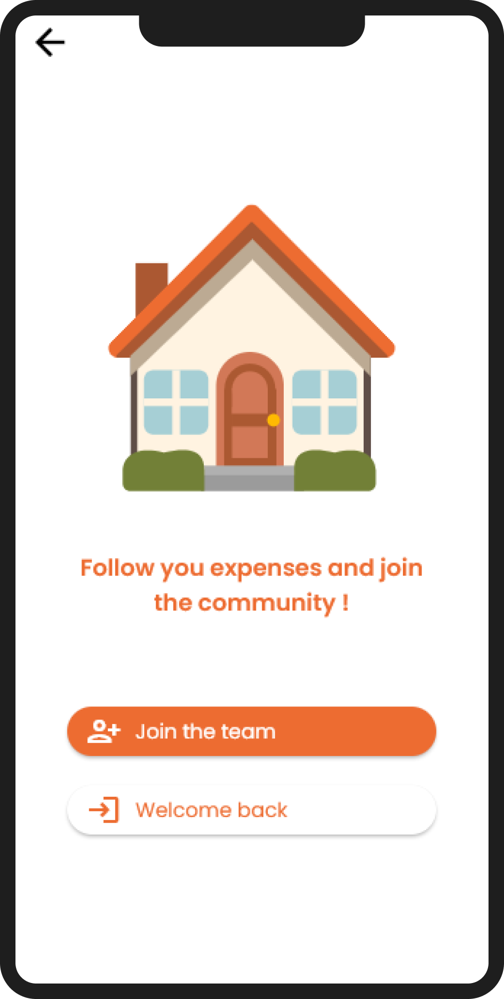
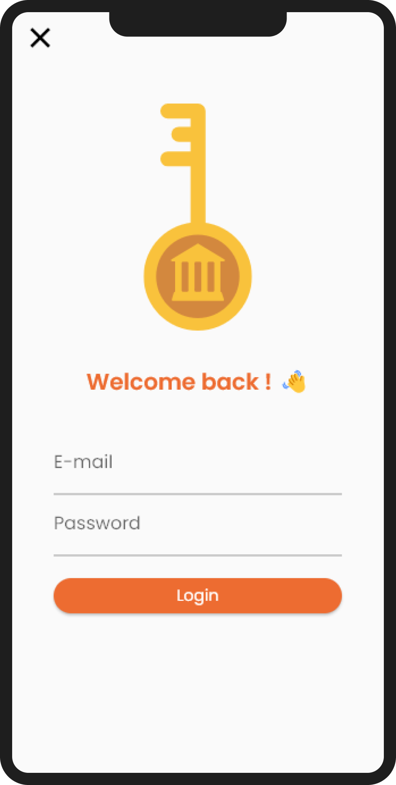

# 🏠 Residencekeeper

  
  
  ## Your Ally for Harmonious Living
  

Residence Keeper is much more than just a roommate management app. It's your partner for harmonious and hassle-free cohabitation, whether you share an apartment with friends, roommates, or family members. Residence Keeper simplifies the management of your finances, household tasks, budget tracking, and communication within your home.

### Streamlined Expense Sharing

Say goodbye to tedious calculations and disputes over common expenses. Residence Keeper allows you to easily track and equitably split shared living expenses with a glance. Record bills, rent, grocery costs, and more, and let the app handle the rest. No more worries about who owes what to whom!

### Intuitive Budget Tracking

Effortlessly manage your budget with Residence Keeper's intuitive budget tracking tool. Visualize your expenditures, set financial goals, and monitor your progress. Effective budget management is at your fingertips.

### Security and Privacy

We understand the importance of data security. Residence Keeper ensures the confidentiality of your financial information and in-app communication. Your data is in good hands.

### Ready to Simplify Your Shared Living?

Residence Keeper is here to help you manage your shared living arrangement with peace of mind. Don't let expenses, household chores, or budget tracking disrupt your communal living experience. Try Residence Keeper today and discover how it can make your shared living more enjoyable, organized, and financially responsible than ever before.

## Based on API

Residence Keeper is powered by its own API, which is available here [ResidenceKeeper API](https://github.com/Psykoxen/ResidenceKeeper-API)
The Residence Keeper API provides the backbone for seamless data synchronization and communication, ensuring a reliable and efficient experience for our users.

  
 **Get ready for a stress-free shared living experience. Residence Keeper, the ultimate companion for community living.**
 

## Preview

  
  
  
  

## Author

👤 **Antoine Voillot**

- Github: [@Psykoxen](https://github.com/Psykoxen)
- LinkedIn: [Antoine Voillot](https://linkedin.com/in/www.linkedin.com/in/antoine-voillot)

## 🤝 Contributing

Contributions, issues and feature requests are welcome! Feel free to check [issues page](https://github.com/Psykoxen/ResidenceKeeper/issues). You can also take a look at the [contributing guide](https://github.com/Psykoxen/ResidenceKeeper/blob/master/CONTRIBUTING.md).

## Show your support

Give a ⭐️ if this project helped you!

## 📝 License

Copyright © 2023 [Antoine Voillot](https://github.com/Psykoxen). 
This project is [MIT](https://github.com/Psykoxen/ResidenceKeeper/blob/master/LICENSE) licensed.
